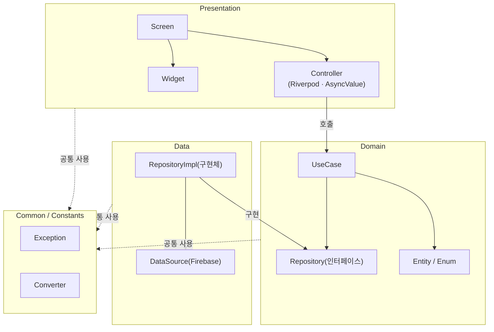
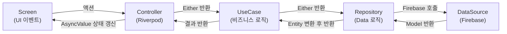
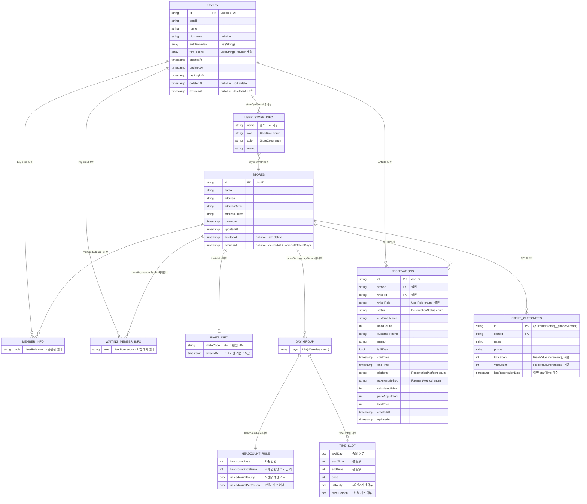

# SpaceManager
> 공간대여업 점포의 예약을 간편하게 관리하는 크로스플랫폼(iOS, Android) 앱입니다.
>
> [Figma](https://www.figma.com/design/k9iL4QL7DsR93RoyoqHrkU/studio-chance?node-id=0-1&t=cOvS5HBllgn6Uxjm-1)
>
> 개발 기간: 2026.12.10 ~

<br>

## 👥 대상 사용자
- 스튜디오, 연습실, 파티룸 등 공간대여 점포를 운영하는 사람
- 여러 점포를 한 곳에서 관리하고 싶은 사람
- 직원과 함께 예약 현황을 공유하고 싶은 사람

<br><br>

## 🛠️ 기술 스택

|      범위       | 기술 이름                                                                                                |
| :-------------: | :------------------------------------------------------------------------------------------------------- |
|  의존성 관리 도구  | `pub.dev`                                                                                                |
|   형상 관리 도구   | `Git`, `GitHub`                                                                                          |
|    아키텍처     | `Clean Architecture`, `MVVM`                                                                             |
|   디자인 시스템   | `Material 3`                                                                                             |
|    상태 관리    | `Riverpod` (코드 생성)                                                                                    |
|    네비게이션    | `GoRouter`                                                                                               |
|    불변 객체    | `Freezed`                                                                                                |
|    에러 처리    | `fpdart` (Either 패턴)                                                                                    |
|    Firebase    | `Firestore`, `Authentication`, `Crashlytics`, `Cloud Messaging`, `Analytics`, `App Check`               |
|   소셜 로그인    | `Google Sign-In`, `Apple Sign-In`                                                                        |
|   내부 저장소    | `SharedPreferences`                                                                                      |
|      로깅       | `logger`                                                                                                 |
|      테스트      | `flutter_test`, `mocktail`                                                                               |

<br><br>

## 🔨 개발 환경


<br><br>

## 📊 아키텍처

### 레이어 구조



### 데이터 흐름



---

<br>

## 🗄️ Firestore ERD

### 컬렉션 구조

```
Firestore
├── users/{uid}                                          ← 최상위 컬렉션
│   └── storeById: { [storeId]: UserStoreInfo }          ← 내장 맵
└── stores/{storeId}                                     ← 최상위 컬렉션
    ├── memberById: { [uid]: StoreMemberInfo }            ← 내장 맵 (승인된 멤버)
    ├── waitingMemberById: { [uid]: StoreMemberInfo }     ← 내장 맵 (가입 대기)
    ├── inviteInfo: InviteInfo?                           ← 내장 객체 (nullable)
    ├── priceSettings                                     ← 내장 객체
    │   └── dayGroups[]: DayGroup                        ← 내장 배열
    │       ├── headcountRule: HeadcountRule              ← 내장 객체
    │       └── timeSlots[]: TimeSlot                    ← 내장 배열
    ├── reservations/{reservationId}                     ← 서브컬렉션
    └── storeCustomers/{customerName}_{phoneNumber}       ← 서브컬렉션
```

### ERD

> **범례**
> - 실선 관계 (`내장`): 동일 문서에 포함된 중첩 객체/맵
> - 점선 참조 (`참조`): 다른 문서의 ID를 키 또는 필드로 저장



---

<br>

## 👨‍💻 트러블 슈팅

### (트러블슈팅 제목)

#### 문제 상황

#### 원인 분석

#### 해결 과정

---

<br>

## 📱 주요 기능

1. **기능 제목**
   > 기능 설명

<br><br>
