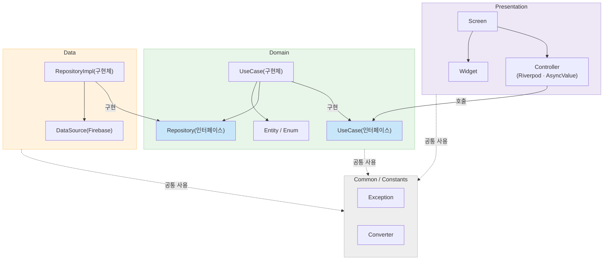
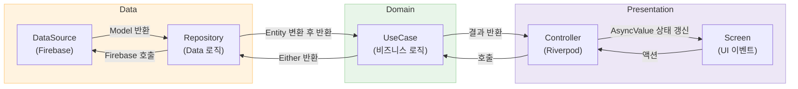
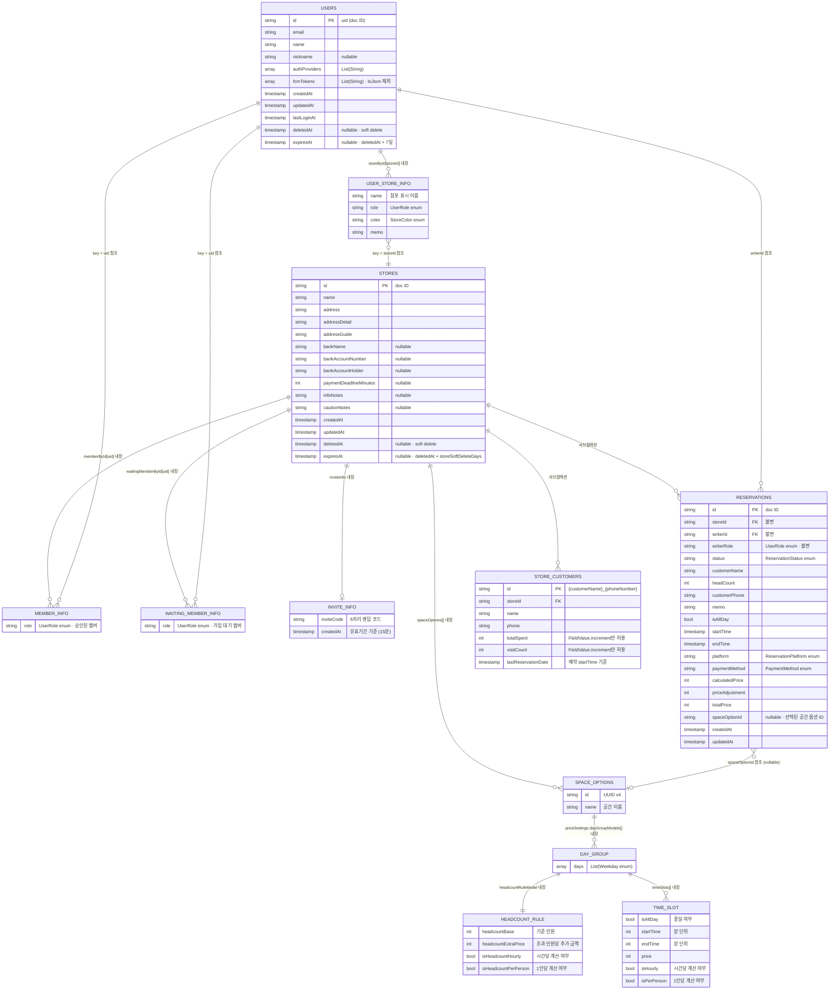

# SpaceManager
> 공간대여업 점포의 예약을 간편하게 관리하는 크로스플랫폼(iOS, Android) 앱입니다.
>
> [Figma](https://www.figma.com/design/k9iL4QL7DsR93RoyoqHrkU/studio-chance?node-id=0-1&t=cOvS5HBllgn6Uxjm-1)
>
> 개발 기간: 2025.12.10 ~

<br>

## 👥 대상 사용자
- 스튜디오, 연습실, 파티룸 등 공간대여 점포를 운영하는 사람
- 여러 점포를 한 곳에서 관리하고 싶은 사람
- 직원과 함께 예약 현황을 공유하고 싶은 사람

<br><br>

## 🛠️ 기술 스택

|    범위    | 기술 이름                                                                                                            |
| :------: | :--------------------------------------------------------------------------------------------------------------- |
|   아키텍처   | `Clean Architecture`, `MVVM`                                                                                     |
| 디자인 시스템  | `Material 3`                                                                                                     |
|  상태 관리   | `Riverpod` (코드 생성)                                                                                               |
|  네비게이션   | `GoRouter`                                                                                                       |
|  불변 객체   | `Freezed`                                                                                                        |
|  에러 처리   | `fpdart` (Either 패턴)                                                                                             |
| Firebase | `Firestore`, `Authentication`, `Crashlytics`, `Cloud Messaging`, `Analytics`, `App Check`, `Firebase AI(Gemini)` |
|  소셜 로그인  | `Google Sign-In`, `Apple Sign-In`                                                                                |
|  내부 저장소  | `SharedPreferences`                                                                                              |
|    로깅    | `logger`                                                                                                         |
|   테스트    | `flutter_test`, `mocktail`, `fake_cloud_firestore`                                                               |
| 형상 관리 도구 | `Git`, `GitHub`                                                                                                  |

<br><br>

## 🔨 개발 환경


%20~-%233DDC84?logo=android&logoColor=white)

<br><br>

## 📊 아키텍처

### 레이어 구조



### 데이터 흐름



---

<br>

## 🗄️ Firestore ERD

### 컬렉션 구조

```
Firestore
├── users/{uid}                                               ← 최상위 컬렉션
│   └── storeById: { [storeId]: UserStoreInfo }               ← 내장 맵
└── stores/{storeId}                                          ← 최상위 컬렉션
    ├── memberById: { [uid]: StoreMemberInfo }                 ← 내장 맵 (승인된 멤버)
    ├── waitingMemberById: { [uid]: StoreMemberInfo }          ← 내장 맵 (가입 대기)
    ├── inviteInfo: InviteInfo?                                ← 내장 객체 (nullable)
    ├── spaceOptions[]: SpaceOption                           ← 내장 배열 (공간 옵션)
    │   └── priceSettings                                      ← 내장 객체 (공간별 요금 설정)
    │       └── dayGroupModels[]: DayGroup                    ← 내장 배열
    │           ├── headcountRuleModel: HeadcountRule          ← 내장 객체
    │           └── timeSlots[]: TimeSlot                     ← 내장 배열
    ├── reservations/{reservationId}                          ← 서브컬렉션
    └── storeCustomers/{customerName}_{phoneNumber}            ← 서브컬렉션
```

### ERD

> **범례**
> - 실선 관계 (`내장`): 동일 문서에 포함된 중첩 객체/맵
> - 점선 참조 (`참조`): 다른 문서의 ID를 키 또는 필드로 저장



---

<br>

## 👨‍💻 트러블 슈팅

### 예약 상세 모달 — 읽기/편집 모드 전환 시 스크롤 위치 초기화

#### 모달 구조

예약 상세 모달은 하나의 화면 안에서 읽기 전용 뷰와 편집 뷰를 인라인으로 전환하는 구조다.  
편집 버튼을 탭하면 같은 위치에서 필드가 수정 가능한 상태로 바뀌고, 완료 또는 취소 시 읽기 전용 뷰로 돌아온다.  
두 뷰 모두 필드가 많아 스크롤이 필요하며, 모드 전환 시 스크롤 위치를 유지해야 UX가 자연스럽다.

<br>

#### 문제 상황

초기 구현에서는 하나의 `ScrollController`를 읽기/편집 뷰가 공유하고, `setState`로 `_isEditing` 플래그를 바꿔 child를 교체하는 방식을 사용했다.  
이 방식에서는 편집 버튼을 탭했을 때 스크롤이 항상 맨 위로 초기화되는 문제가 발생했다.

<br>

#### 원인 분석

Flutter의 `SingleChildScrollView`는 child가 교체되면 내부적으로 viewport를 재계산하고 `ScrollPosition.pixels`를 `0.0`으로 초기화한다.  
이 시점에 이전 offset을 복원하려면 build 이후 시점에 호출해야 하므로, `addPostFrameCallback`을 사용해 offset을 복원하는 방식을 먼저 시도했다.

``` dart
void _switchToEdit() {
  final savedOffset = _scrollController.offset;
  setState(() => _isEditing = true);
  WidgetsBinding.instance.addPostFrameCallback((_) {
    if (_scrollController.hasClients) {
      _scrollController.jumpTo(
        savedOffset.clamp(0.0, _scrollController.position.maxScrollExtent),
      );
    }
  });
}
```

하지만 이 방식에서도 한 프레임 동안 스크롤이 맨 위에 머무는 flash가 발생했다.  
원인은 Flutter frame pipeline의 실행 순서에 있었다.

```
build → layout → paint → postFrameCallbacks
```

`addPostFrameCallback`은 **paint 이후**에 실행된다.  
즉, 스크롤이 0으로 초기화된 상태가 이미 화면에 그려진 뒤에 offset 복원이 이루어지므로, 사용자 눈에는 맨 위로 순간 이동했다가 돌아오는 flash가 한 프레임 보이게 된다.

<br>

#### 해결 과정

근본 원인은 child 교체 → viewport 재계산 → `ScrollPosition` 초기화 흐름에 있었다.  
따라서 viewport 재계산 자체가 발생하지 않도록 구조를 바꾸었다.

읽기 전용 뷰와 편집 뷰를 각각 독립된 `ScrollController`와 `SingleChildScrollView`로 구성하고, `Stack + Positioned.fill + Offstage`로 두 뷰를 **항상 위젯 트리에 유지**했다.  
`Offstage(offstage: true)`는 해당 subtree를 layout은 유지한 채 paint와 hit-test만 생략한다.  
두 뷰가 트리에서 제거되지 않으므로 각자의 `ScrollPosition`이 모드 전환 중에도 보존된다.

모드 전환 전 `_syncScrollPosition()`을 `setState()` **이전에 동기적으로** 호출해 비활성 뷰의 offset을 활성 뷰에 맞춰 복사했다.  
`setState` 이전에 실행되므로 build/paint 단계에 진입하기 전에 두 뷰의 offset이 일치한 상태가 되고, flash가 발생하지 않는다.

<details>
    <summary>문제 코드 — 단일 ScrollController + addPostFrameCallback</summary>
    <div markdown="1">

```dart
// 단일 ScrollController를 읽기/편집이 공유
late final ScrollController _scrollController;

@override
void initState() {
  super.initState();
  _scrollController = ScrollController();
}

@override
void dispose() {
  _scrollController.dispose();
  super.dispose();
}

// 편집 모드 진입: child가 교체되며 ScrollPosition이 0으로 초기화됨
// addPostFrameCallback으로 복원 시도 → paint 이후 실행되어 flash 발생
void _switchToEdit() {
  final savedOffset = _scrollController.offset;
  setState(() => _isEditing = true);
  WidgetsBinding.instance.addPostFrameCallback((_) {
    if (_scrollController.hasClients) {
      _scrollController.jumpTo(
        savedOffset.clamp(0.0, _scrollController.position.maxScrollExtent),
      );
    }
  });
}

Widget _buildScrollArea(TextTheme textTheme) {
  return SingleChildScrollView(
    controller: _scrollController,
    child: _isEditing
        ? _buildEditBody(textTheme)
        : _buildReadOnlyBody(textTheme),
  );
}
```

</details>

<details>
    <summary>해결 코드 — 독립 ScrollController + Offstage + 동기 offset 복사</summary>
    <div markdown="1">

```dart
// 모드별 독립 ScrollController
//   - 두 ScrollView가 항상 트리에 존재 → 각자의 ScrollPosition 보존
//   - Offstage(offstage: true): layout은 유지, paint/hit-test 제외
//   - 전환 전 _syncScrollPosition()으로 오프셋 수동 동기화
late final ScrollController _readOnlyController;
late final ScrollController _editController;

@override
void initState() {
  super.initState();
  _readOnlyController = ScrollController();
  _editController = ScrollController();
}

@override
void dispose() {
  _readOnlyController.dispose();
  _editController.dispose();
  super.dispose();
}

/// 모드 전환 전 비활성 뷰의 오프셋을 활성 뷰에 맞춰 동기화한다.
/// setState() 호출 전에 실행해야 한다.
void _syncScrollPosition({required bool toEdit}) {
  final from = toEdit ? _readOnlyController : _editController;
  final to   = toEdit ? _editController : _readOnlyController;
  if (!from.hasClients || !to.hasClients) return;
  if (!from.position.haveDimensions || !to.position.haveDimensions) return;
  to.jumpTo(from.offset.clamp(0.0, to.position.maxScrollExtent));
}

// 편집 진입: 동기화 먼저 → setState (flash 없음)
onPressed: () {
  _syncScrollPosition(toEdit: true);
  setState(() => _isEditing = true);
}

// 편집 완료/취소: 동기화 먼저 → setState
void _onComplete() {
  // ... 저장 로직 ...
  _syncScrollPosition(toEdit: false);
  setState(() {
    _isEditing = false;
    _isStartPickerOpen = false;
    _isEndPickerOpen = false;
  });
}

// 두 뷰를 항상 트리에 유지 — Offstage가 비활성 뷰의 paint를 생략
Widget _buildScrollArea(TextTheme textTheme) {
  return Stack(
    children: [
      Positioned.fill(
        child: Offstage(
          offstage: _isEditing,
          child: SingleChildScrollView(
            controller: _readOnlyController,
            child: _buildReadOnlyBody(textTheme),
          ),
        ),
      ),
      Positioned.fill(
        child: Offstage(
          offstage: !_isEditing,
          child: SingleChildScrollView(
            controller: _editController,
            child: _buildEditBody(textTheme),
          ),
        ),
      ),
    ],
  );
}
```

</details>

<br>

#### 결론 및 회고

|    설명    |   화면   |
| :-------------: | :----------: |
| addPostFrameCallback (flash 발생) |  |
| Offstage + 동기 offset 복사 (해결) |  |

<br>

`addPostFrameCallback`은 paint 이후에 실행되기 때문에 이미 그려진 프레임을 되돌리는 것이 불가능하다. 이 문제는 타이밍을 조정해서 해결할 수 있는 것이 아니라, viewport 재계산이 발생하지 않는 구조로 바꿔야 근본적으로 해결된다.  
`Offstage`는 subtree를 트리에서 제거하지 않고 paint만 생략하기 때문에 이 목적에 정확히 맞는 위젯이었다. Flutter의 렌더링 파이프라인 순서와 각 위젯 API가 어느 단계에서 동작하는지를 파악하고 있어야 올바른 선택을 할 수 있다는 점을 직접 경험했다.

---

<br>

## 📱 주요 기능

1. **기능 제목**
   > 기능 설명

<br><br>
